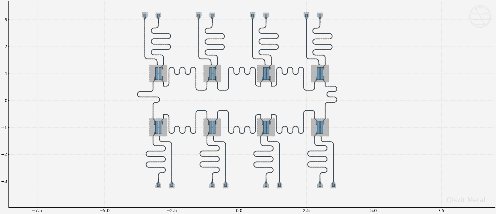
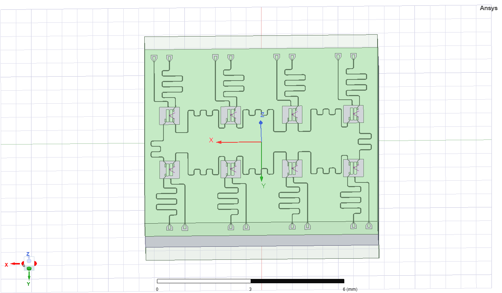
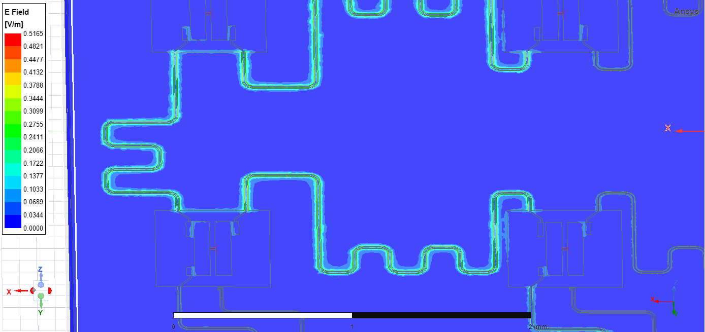
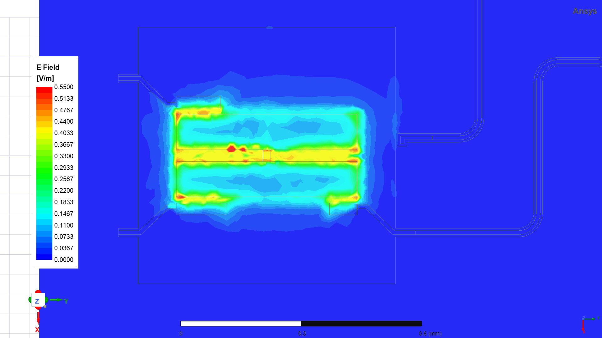
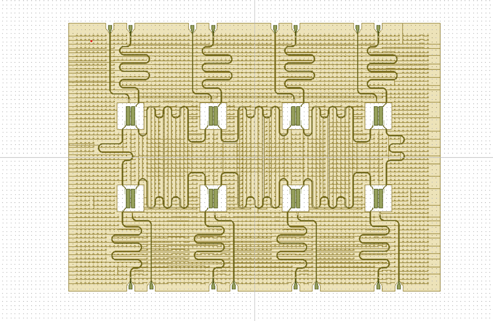

# Qiskit Metal - Qchip 8 Qubits

## Tools

- Jupyter Notebook
- Qiskit Metal
- Ansys

## Features

- Hamiltonian
- Qiskit Metal Layout
- EPR Analysis
- LOM Analysis
- GDSII

## Demonstration

#### Hamiltonian

#### Qiskit Metal Layout

#### Ansys Render

#### Ansys EPR

#### Transmon seperately

#### LOM Analysis

#### GDSII

## Appendix

Any additional information goes here

## Documentation

[QMetal](https://qiskit.org/documentation/metal/)

